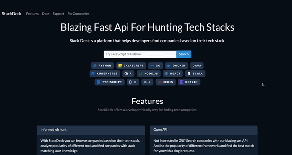

# StackDeck.dev
StackDeck is a web platform that helps developers search for companies based on their tech stack.




### Overview
##### What is StackDeck?
StackDeck is a platform that helps developers find companies based on their tech stack, compare different stacks and analyze popularity of different frameworks. The underlying dataset is scraped from the job listings available online and organised into a JSON.

You can use both the frontend and the API for browsing through the JSON dataset. The frontend search provides a grid of cards where each card represents a single company. Each card contains the company name, flavour text, the tech used by the company. You can navigate the page and click on any technology. The deck of cards will be shuffled to display only the companies that use the selected technology.


The frontend is purely for illustration purposes and has limited functionality.

Sample Request:
```python
import requests

company_name = "Monty Python"
url = f"https://stackdeck.dev/cards/?name={company_name}"

response = requests.get(url)
print(response.json())
```
Sample  Response:
```json
{
  "name": "Monty Python",
  "location": [
    "Camelot"
  ],
  "stack": [
    "Graham Chapman",
    "Holly Hand Grenade",
    "John Cleese"
  ],
  "flavor": "You've got two empty halves of coconuts and your bangin'em together.",
  "website": "https://en.wikipedia.org/wiki/Monty_Python",
  "tags": [],
  "alt_link": "",
  "premium": false
}
```
More detailed examples can be found in the WIKI:

[](https://github.com/Geometrein/stackdeck/wiki)

You can check out the docs and all available methods here:

[](https://stackdeck.dev/docs)

### Installation

---

Running the app with Docker Compose:
```docker
docker-compose up
```
Running the app with Docker:
```docker
docker build -t stack-deck stackdeck   
docker run -d --name mycontainer -p 80:80 stack-deck
```
The old school way:
```
python3 -m venv venv
source venv/bin/activate
pip install -r requirements.txt
```

You're all set 🚀

## **Contributing**

---

### How to add companies?
1) **[Fork](https://github.com/Geometrein/stackdeck/fork)  the project.**
2) **Edit the `deck.json` file located in the `data` folder.**
   1) Make sure the company you're adding is not already present.
   2) Make sure the framework names are consistent with the existing ones.
   3) Each company is assigned a random 10 character ID you can generate it [here](https://stackdeck.dev/docs#/default/generate_card_id_util_id_generator__get).
3) **Submit a pull request.** 
   1) Ideally, include a source so that the added information can be verified.<br>For example, you could link to your linkedin that shows you have worked in the company that you added/modified.


[](https://github.com/Geometrein/stackdeck/pull/2)
